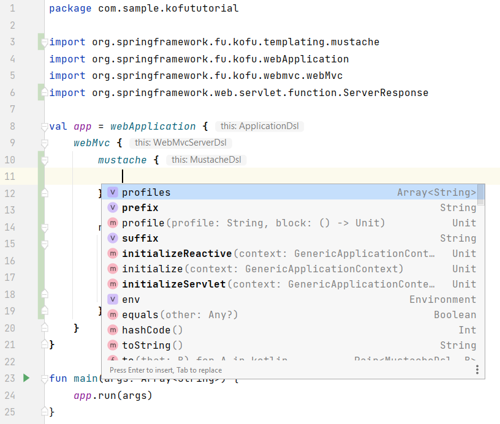

:spring-fu-version: 0.5.0
:kofu-kdoc-url: http://repo.spring.io/milestone/org/springframework/fu/spring-fu-kofu/{spring-fu-version}/spring-fu-kofu-{spring-fu-version}-javadoc.jar!

image:https://img.shields.io/badge/KoFu%20documentation-blue.svg["KoFu documentation", link="{kofu-kdoc-url}/kofu/index.html"]

== KoFu DSL for Spring Boot

KoFu (for **Ko**tlin and **Fu**nctional) is an alternative way of configuring explicitly your Spring Boot application,
different from regular auto-configuration, using a Kotlin DSL. It is based on Spring Boot infrastructure, but
https://github.com/spring-projects/spring-fu/tree/main/autoconfigure-adapter[used via functional bean definitions]
instead of JavaConfig.

It leverages other Spring Kotlin DSLs available in Spring like:

* https://docs.spring.io/spring/docs/current/spring-framework-reference/languages.html#kotlin-bean-definition-dsl[`beans { }` DSL] from Spring Framework
* https://docs.spring.io/spring/docs/current/spring-framework-reference/languages.html#router-dsl[`router { }` DSL] from Spring MVC or Spring WebFlux
* https://github.com/spring-projects-experimental/spring-security-kotlin-dsl[`security { }` DSL] (work in progress) from Spring Security

=== Differences with regular Boot applications

- Spring optimizations for native applications are enabled by default
- XML support is disabled by default
- SpEL support is disabled by default
- Devtools automatic restart does not work yet so just restart your applications (very fast with KoFu)

== Content of this tutorial

We are going to build the same blog application as https://spring.io/guides/tutorials/spring-boot-kotlin/[the tutorial for writing Spring Boot applications in Kotlin].

Instead of Spring Data JPA, we are going to use plain JDBC, in order to avoid completely the use of CGLIB.
Writing repositories in plain JDBC requires a consistent extra effort. Fortunately, there exist light ORM like
https://github.com/JetBrains/Exposed[Jetbrains Exposed] or https://www.jooq.org/[Jooq], that are an excellent trade-off
between the productivity of JPA and the readability/testability of plain JDBC. But those are out of the scope of this tutorial.

We will see how KoFu enhances the testability of our code, removing the "magics" of annotations autowiring, and giving you back
the full control of the dependency injection context.

In the end we will see an example of how to plugin-in modules that are not yet fully supported like https://liquibase.org/[Liquibase].

== Getting started
Click https://start.spring.io/#!type=gradle-project&language=kotlin&platformVersion=2.6.3&packaging=jar&jvmVersion=11&groupId=com.example&artifactId=blog&name=blog&description=&packageName=com.example.blog&dependencies=web,mustache,jdbc,h2[here] to go to a preconfigured Spring Initializer

We selected:

1. Gradle (Kotlin DSL) as the build system and Kotlin as language.
2. The latest stable Spring Boot `2.6.x` version (2.6.3 at the moment of writing).
3. Changed the name of artifact to "blog"
4. Jar packaging and Jvm 11 target
5. The following dependencies:
    * Spring Web
    * Mustache
    * Jdbc API
    * H2 in-memory Database

The zip contains a regular spring application template. Unpack and open it with the IDE of your choice (here we are going to use IntelliJ).

=== Modify the Gradle and Maven builds

Go to `build.gradle.kts` (Gradle) or `pom.xml` (Maven). If you don't know their content, you can refer to the sections "Understanding the Gradle Build" or "Understanding the Maven Build" of https://spring.io/guides/tutorials/spring-boot-kotlin/#understanding-generated-app[this] other tutorial.

==== Repositories

Add the spring milestone repository.

===== Gradle

[source,kotlin]
----
repositories {
    maven {
        url = uri("https://repo.spring.io/milestone")
    }
    mavenCentral()
}
----

===== Maven

[source,xml]
----
<repositories>
    <repository>
        <id>spring-milestone</id>
        <name>spring milestone</name>
        <url>https://repo.spring.io/milestone</url>
    </repository>
</repositories>
----

==== Dependencies

Add the Kofu dependency. At the time of writing the latest version of KoFu is the `0.5.0`.

===== Gradle

[source,kotlin]
----
dependencies {
    ...
    implementation("org.springframework.fu:spring-fu-kofu:$kofuVersion")
    ...
}
----

===== Maven

[source,xml]
----
<dependency>
    <groupId>org.springframework.fu</groupId>
    <artifactId>spring-fu-kofu</artifactId>
    <version>${kofu.version}</version>
</dependency>
----

==== Remove plugins (optional)

Let's remove what we don't need anymore. With KoFu, there are no more GCLIB proxies in place, then we don't need to `open` the classes of our beans (classes are `final` by default in Kotlin).

Then we can remove the unnecessary plugins.

===== Gradle

Open  `build.gradle.kts` and remove the following line:

[source,kotlin]
----
kotlin("plugin.spring") version "1.4.32"
----

The plugin section should look like this:

[source,kotlin]
----
plugins {
    id("org.springframework.boot") version "2.6.3"
    id("io.spring.dependency-management") version "1.0.11.RELEASE"
    kotlin("jvm") version "1.6.10"
}
----

===== Maven

Remove the marked lines from your `pom.xml`

[source,xml]
----
<plugins>
  <plugin>
    <groupId>org.jetbrains.kotlin</groupId>
    <artifactId>kotlin-maven-plugin</artifactId>
    <configuration>
      <compilerPlugins>           <!-- REMOVE THIS -->
        <plugin>spring</plugin>   <!-- REMOVE THIS -->
      </compilerPlugins>          <!-- REMOVE THIS -->
      <args>
        <arg>-Xjsr305=strict</arg>
      </args>
    </configuration>
    <dependencies>
      <dependency>                                    <!-- REMOVE THIS -->
        <groupId>org.jetbrains.kotlin</groupId>       <!-- REMOVE THIS -->
        <artifactId>kotlin-maven-allopen</artifactId> <!-- REMOVE THIS -->
        <version>${kotlin.version}</version>          <!-- REMOVE THIS -->
      </dependency>                                   <!-- REMOVE THIS -->
    </dependencies>
  </plugin>
</plugins>
----

The plugin section should look like this:

[source,xml]
----
<plugins>
    <plugin>
        <groupId>org.springframework.boot</groupId>
        <artifactId>spring-boot-maven-plugin</artifactId>
    </plugin>
    <plugin>
        <groupId>org.jetbrains.kotlin</groupId>
        <artifactId>kotlin-maven-plugin</artifactId>
        <version>${kotlin.version}</version>
        <configuration>
            <jvmTarget>11</jvmTarget>
            <args>
                <arg>-Xjsr305=strict</arg>
            </args>
        </configuration>
    </plugin>
</plugins>
----

=== Modify The generated application

Go to `BlogApplication.kt` and modify its content as follows:

`src/main/kotlin/com/example/blog/BlogApplication.kt`

[source,kotlin]
----
package com.sample.blog

import org.springframework.fu.kofu.webApplication
import org.springframework.fu.kofu.webmvc.webMvc

val app = webApplication {
    webMvc {
    }
}

fun main(args: Array<String>) {
    app.run(args)
}
----

== Writing your first route

Let's write the routing to display a simple web page

`src/main/kotlin/com/example/blog/BlogApplication.kt`

[source,kotlin]
----
val app = webApplication {
    webMvc {
        mustache()

        router {
            GET("/"){
                ServerResponse.ok()
                    .render("blog", mapOf("title" to "Blog"))
            }
        }
    }
}

fun main(args: Array<String>) {
    app.run(args)
}
----
Notice that the `render` method doesn't use a `Model` class but just a `Map<String, Any>`.

Also, we are explicitly declaring the use of `mustache` through the activation function call. KoFu doesn't start things automatically. We have to
declare it. The cool part is that you can explore all the possible configuration options using the IDE code completion.

For example, here we see that mustache has two properties: `prefix` and `suffix`, to change the directory of the templates and the templates
extension, respectively. To test this feature, instead of using the default templates folder `classpath:/templates/`, we are going to change
it to `classpath:/views/`

`src/main/kotlin/com/example/blog/BlogApplication.kt`

[source,kotlin]
----
val app = webApplication {
    webMvc {
        mustache{
            prefix = "classpath:/views/"
        }
        ...
    }
}
----

In the `views` folder we create the following template:

`src/main/resources/views/blog.mustache`

[source,html]
----
<html>
    <head>
        <title>{{title}}</title>
    </head>
    <body>
        <h1>{{title}}</h1>
    </body>
</html>
----

Start the web application by running the main function of BlogApplication.kt, and go to http://localhost:8080/,
you should see a sober web page with a "Blog" headline.

== Testing with JUnit5

Compared to regular Spring Boot, where you have to use the annotion `SpringBootTest`, there is nothing fancy to do
with a KoFu test. You write a normal test, and start/stop spring in the `@BeforeAll` and `@AfterAll`. It is a
regular JUnit test.

`src/test/kotlin/com/example/blog/BlogTests.kt`

[source,kotlin]
----
@TestInstance(TestInstance.Lifecycle.PER_CLASS)
class BlogTests {
    lateinit var context: ConfigurableApplicationContext
    lateinit var client: MockMvc

    @BeforeAll
    internal fun setUp() {
        val port = (10000..10500).random()

        context = app.run(arrayOf("--spring.port=${port}"))
        client = MockMvcBuilders
            .webAppContextSetup(context as WebApplicationContext)
            .build()
    }

    @AfterAll
    internal fun tearDown() {
        context.close()
    }

    @Test
    internal fun `Assert blog page title, content and status code`() {
        client.get("/")
            .andExpect {
                status { isOk() }
                content {
                    string(Matchers.containsString("<h1>Blog</h1>"))
                }
            }
    }
}
----

There is no magic here. Everything is transparent.

`@TestInstance(TestInstance.Lifecycle.PER_CLASS)` is related to JUnit 5, you
probably already know what it is if you use JUnit 5. https://www.baeldung.com/junit-testinstance-annotation[It is needed to use `@BeforeAll` and `@AfterAll`] annotations.
You can change the tests instances lyfe cycle also project-wise if you like it, as described https://github.com/spring-guides/tut-spring-boot-kotlin#test-instance-lifecycle[here].
I would not suggest doing it.

In the `@BeforeAll` we start spring on a random port and use the application context to create the MockMvClient, so that
it points to correct port.

We then use the `client` to perform the http requests in the test and verify the result. More on MockMvc https://www.baeldung.com/integration-testing-in-spring[here].