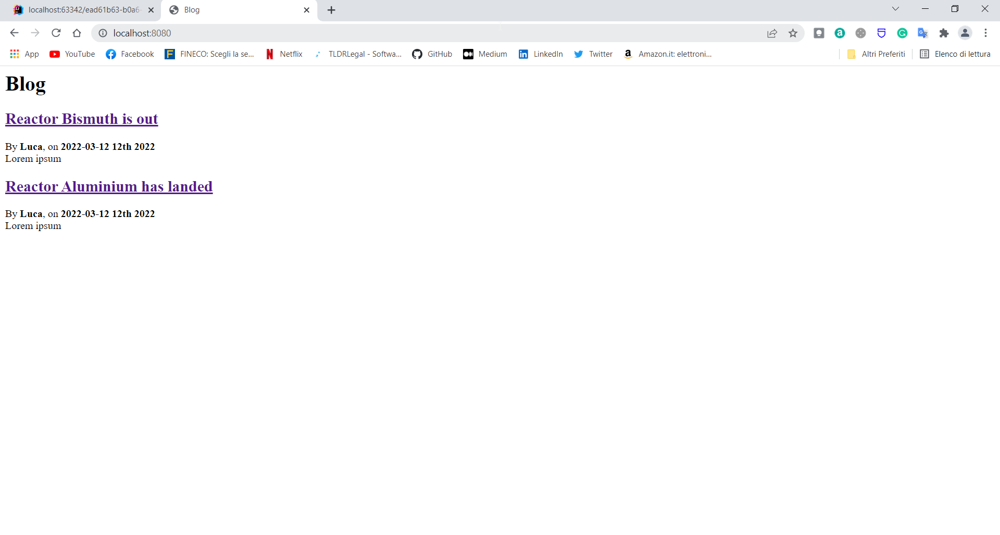
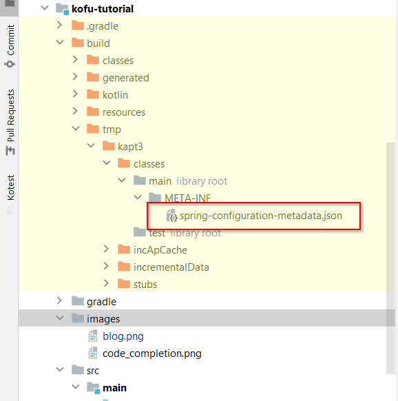

:spring-fu-version: 0.5.0
:kofu-kdoc-url: http://repo.spring.io/milestone/org/springframework/fu/spring-fu-kofu/{spring-fu-version}/spring-fu-kofu-{spring-fu-version}-javadoc.jar!

image:https://img.shields.io/badge/KoFu%20documentation-blue.svg["KoFu documentation", link="{kofu-kdoc-url}/kofu/index.html"]

== KoFu DSL for Spring Boot

KoFu (for **Ko**tlin and **Fu**nctional) is an alternative way of configuring explicitly your Spring Boot application,
different from regular auto-configuration, using a Kotlin DSL. It is based on Spring Boot infrastructure, but
https://github.com/spring-projects/spring-fu/tree/main/autoconfigure-adapter[used via functional bean definitions]
instead of JavaConfig.

It leverages other Spring Kotlin DSLs available in Spring like:

* https://docs.spring.io/spring/docs/current/spring-framework-reference/languages.html#kotlin-bean-definition-dsl[`beans { }` DSL] from Spring Framework
* https://docs.spring.io/spring/docs/current/spring-framework-reference/languages.html#router-dsl[`router { }` DSL] from Spring MVC or Spring WebFlux
* https://github.com/spring-projects-experimental/spring-security-kotlin-dsl[`security { }` DSL] (work in progress) from Spring Security

=== Differences with regular Boot applications

- Spring optimizations for native applications are enabled by default
- XML support is disabled by default
- SpEL support is disabled by default
- Devtools automatic restart does not work yet so just restart your applications (very fast with KoFu)

== Content of this tutorial

We are going to build the same blog application as https://spring.io/guides/tutorials/spring-boot-kotlin/[the tutorial for writing Spring Boot applications in Kotlin].

Instead of Spring Data JPA, we are going to use plain JDBC, in order to avoid completely the use of CGLIB.
Writing repositories in plain JDBC requires a consistent extra effort. Fortunately, there exist light ORM like
https://github.com/JetBrains/Exposed[Jetbrains Exposed] or https://www.jooq.org/[Jooq], that are an excellent trade-off
between the productivity of JPA and the readability/testability of plain JDBC. But those are out of the scope of this tutorial.

We will see how KoFu enhances the testability of our code, removing the "magics" of annotations autowiring, and giving you back
the full control of the dependency injection context.

In the end we will see an example of how to plugin-in modules that are not yet fully supported like https://liquibase.org/[Liquibase].

== Getting started
Click https://start.spring.io/#!type=gradle-project&language=kotlin&platformVersion=2.6.3&packaging=jar&jvmVersion=11&groupId=com.example&artifactId=blog&name=blog&description=&packageName=com.example.blog&dependencies=web,mustache,jdbc,h2[here] to go to a preconfigured Spring Initializer

We selected:

1. Gradle (Kotlin DSL) as the build system and Kotlin as language.
2. The latest stable Spring Boot `2.6.x` version (2.6.3 at the moment of writing).
3. Changed the name of artifact to "blog"
4. Jar packaging and Jvm 11 target
5. The following dependencies:
    * Spring Web
    * Mustache
    * Jdbc API
    * H2 in-memory Database

The zip contains a regular spring application template. Unpack and open it with the IDE of your choice (here we are going to use IntelliJ).

=== Modify the Gradle and Maven builds

Go to `build.gradle.kts` (Gradle) or `pom.xml` (Maven). If you don't know their content, you can refer to the sections "Understanding the Gradle Build" or "Understanding the Maven Build" of https://spring.io/guides/tutorials/spring-boot-kotlin/#understanding-generated-app[this] other tutorial.

==== Repositories

Add the spring milestone repository.

===== Gradle

[source,kotlin]
----
repositories {
    maven {
        url = uri("https://repo.spring.io/milestone")
    }
    mavenCentral()
}
----

===== Maven

[source,xml]
----
<repositories>
    <repository>
        <id>spring-milestone</id>
        <name>spring milestone</name>
        <url>https://repo.spring.io/milestone</url>
    </repository>
</repositories>
----

==== Dependencies

Add the Kofu dependency. At the time of writing the latest version of KoFu is the `0.5.0`.

===== Gradle

[source,kotlin]
----
dependencies {
    ...
    implementation("org.springframework.fu:spring-fu-kofu:$kofuVersion")
    ...
}
----

===== Maven

[source,xml]
----
<dependency>
    <groupId>org.springframework.fu</groupId>
    <artifactId>spring-fu-kofu</artifactId>
    <version>${kofu.version}</version>
</dependency>
----

==== Remove plugins (optional)

Let's remove what we don't need anymore. With KoFu, there are no more GCLIB proxies in place, then we don't need to `open` the classes of our beans (classes are `final` by default in Kotlin).

Then we can remove the unnecessary plugins.

===== Gradle

Open  `build.gradle.kts` and remove the following line:

[source,kotlin]
----
kotlin("plugin.spring") version "1.4.32"
----

The plugin section should now look like this:

[source,kotlin]
----
plugins {
    id("org.springframework.boot") version "2.6.3"
    id("io.spring.dependency-management") version "1.0.11.RELEASE"
    kotlin("jvm") version "1.6.10"
}
----

===== Maven

Remove the marked lines from your `pom.xml`

[source,xml]
----
<plugins>
  <plugin>
    <groupId>org.jetbrains.kotlin</groupId>
    <artifactId>kotlin-maven-plugin</artifactId>
    <configuration>
      <compilerPlugins>           <!-- REMOVE THIS -->
        <plugin>spring</plugin>   <!-- REMOVE THIS -->
      </compilerPlugins>          <!-- REMOVE THIS -->
      <args>
        <arg>-Xjsr305=strict</arg>
      </args>
    </configuration>
    <dependencies>
      <dependency>                                    <!-- REMOVE THIS -->
        <groupId>org.jetbrains.kotlin</groupId>       <!-- REMOVE THIS -->
        <artifactId>kotlin-maven-allopen</artifactId> <!-- REMOVE THIS -->
        <version>${kotlin.version}</version>          <!-- REMOVE THIS -->
      </dependency>                                   <!-- REMOVE THIS -->
    </dependencies>
  </plugin>
</plugins>
----

The plugin section should look like this:

[source,xml]
----
<plugins>
    <plugin>
        <groupId>org.springframework.boot</groupId>
        <artifactId>spring-boot-maven-plugin</artifactId>
    </plugin>
    <plugin>
        <groupId>org.jetbrains.kotlin</groupId>
        <artifactId>kotlin-maven-plugin</artifactId>
        <version>${kotlin.version}</version>
        <configuration>
            <jvmTarget>11</jvmTarget>
            <args>
                <arg>-Xjsr305=strict</arg>
            </args>
        </configuration>
    </plugin>
</plugins>
----

=== Modify The generated application

Go to `BlogApplication.kt` and modify its content as follows:

`src/main/kotlin/com/example/blog/BlogApplication.kt`

[source,kotlin]
----
package com.sample.blog

import org.springframework.fu.kofu.webApplication
import org.springframework.fu.kofu.webmvc.webMvc

val app = webApplication {
    webMvc {
    }
}

fun main(args: Array<String>) {
    app.run(args)
}
----

You can try to start the application and everything should be fine.

== Writing your first route

Let's write the routing to display a simple web page

`src/main/kotlin/com/example/blog/BlogApplication.kt`

[source,kotlin]
----
val app = webApplication {
    webMvc {
        mustache()

        router {
            GET("/"){
                ServerResponse.ok()
                    .render("blog", mapOf("title" to "Blog"))
            }
        }
    }
}

fun main(args: Array<String>) {
    app.run(args)
}
----
NOTE: the `render` method doesn't use a `org.springframework.ui.Model` class but a `Map<String, Any>`.

We are explicitly declaring the use of `mustache` through the activation function call. KoFu doesn't start things automatically. We have to
declare it. The cool part is that you can explore all the possible configuration options using the IDE code completion.

image::images/code_completion.png[width=500]

For example, here we see that mustache has two properties: `prefix` and `suffix`, to change the directory of the templates and the templates
extension, respectively. To test this feature, instead of using the default templates folder `classpath:/templates/`, we are going to change
it to `classpath:/views/`

`src/main/kotlin/com/example/blog/BlogApplication.kt`

[source,kotlin]
----
val app = webApplication {
    webMvc {
        mustache{
            prefix = "classpath:/views/"
        }
        ...
    }
}
----

In the `views` folder we create the following template:

`src/main/resources/views/blog.mustache`

[source,html]
----
<html>
    <head>
        <title>{{title}}</title>
    </head>
    <body>
        <h1>{{title}}</h1>
    </body>
</html>
----

Start the web application by running the main function of BlogApplication.kt, and go to http://localhost:8080/,
you should see a sober web page with a "Blog" headline.

== Testing with JUnit5

Compared to regular Spring Boot, where you have to use the annotion `@SpringBootTest`, there is nothing fancy to do
with a KoFu test. You write a normal test, and start/stop spring in the `@BeforeAll` and `@AfterAll`. It is a
regular JUnit test.

`src/test/kotlin/com/example/blog/BlogTests.kt`

[source,kotlin]
----
@TestInstance(TestInstance.Lifecycle.PER_CLASS)
class BlogTests {
    lateinit var context: ConfigurableApplicationContext
    lateinit var client: MockMvc

    @BeforeAll
    internal fun setUp() {
        val port = (10000..10500).random()

        context = app.run(arrayOf("--spring.port=${port}"))
        client = MockMvcBuilders
            .webAppContextSetup(context as WebApplicationContext)
            .build()
    }

    @AfterAll
    internal fun tearDown() {
        context.close()
    }

    @Test
    internal fun `Assert blog page title, content and status code`() {
        client.get("/")
            .andExpect {
                status { isOk() }
                content {
                    string(Matchers.containsString("<h1>Blog</h1>"))
                }
            }
    }
}
----

There is no magic here. Everything is transparent.

`@TestInstance(TestInstance.Lifecycle.PER_CLASS)` is related to JUnit 5, you
probably already know what it is if you use JUnit 5. https://www.baeldung.com/junit-testinstance-annotation[It is needed to use `@BeforeAll` and `@AfterAll`] annotations.
You can change the tests instances life-cycle also project-wise if you like it, as described https://github.com/spring-guides/tut-spring-boot-kotlin#test-instance-lifecycle[here].
I would not suggest of doing it.

In the `@BeforeAll` we start Spring on a random port and use the application context to create the MockMvc, so that
it points to the correct port.

We then use the `client` to perform the http requests in the test and verify the result. More on MockMvc https://www.baeldung.com/integration-testing-in-spring[here].

== Write some extension utilities

We are going to write some extension utilities that we will use in the next section.

`src/main/kotlin/com/example/blog/extensions.kt`

[source,kotlin]
----
fun LocalDateTime.format(): String = this.format(englishDateFormatter)

private val daysLookup = (1..31).associate { it.toLong() to getOrdinal(it) }

private val englishDateFormatter = DateTimeFormatterBuilder()
    .appendPattern("yyyy-MM-dd")
    .appendLiteral(" ")
    .appendText(ChronoField.DAY_OF_MONTH, daysLookup)
    .appendLiteral(" ")
    .appendPattern("yyyy")
    .toFormatter(Locale.ENGLISH)

private fun getOrdinal(n: Int) = when {
    n in 11..13 -> "${n}th"
    n % 10 == 1 -> "${n}st"
    n % 10 == 2 -> "${n}nd"
    n % 10 == 3 -> "${n}rd"
    else -> "${n}th"
}

fun String.toSlug() = lowercase()
    .replace("\n", " ")
    .replace("[^a-z\\d\\s]".toRegex(), " ")
    .split(" ")
    .joinToString("-")
    .replace("-+".toRegex(), "-")
----

== Persistence with JDBC

KoFu doesn't make use of CGLIB. This means that we have to write our repository and map our entities manually. Also mastering JPA
implementations, like Hibernate, is not easy like it seems.

ORM frameworks forces you to model your entities as a 1:1 mapping with the E/R schema of the database. This could lead to design problems like:

 * http://hibernate.org/orm/what-is-an-orm/[Object-Relational impedance mismatch]
 * https://martinfowler.com/bliki/AnemicDomainModel.html[Anemic Domain Model]
 * https://refactoring.guru/smells/primitive-obsession[Primitive obsession coding smell]

=== Domain Entities

Let's model our domain entities at first:

`src/main/kotlin/com/example/blog/entities.kt`

[source,kotlin]
----
sealed class Entity<out T>{
    data class WithId<out T>(val id: Id<Long>, val info: T) : Entity<T>()
    data class New<out T>(val info: T) : Entity<T>()
}

data class Id<T>(val value: T)

data class Name(
    val firstname: String,
    val lastname: String,
)

@JvmInline
value class Login private constructor(val value: String){
    companion object{
        fun of(value: String): Login{
            require(value.isNotEmpty()){ "can't accept an empty login value" }
            return Login(value)
        }
    }
}

data class User(
    val login: Login,
    val name: Name,
    val description: String? = null){

    companion object{
        fun of(
            login: String,
            firstname: String,
            lastname: String,
            description: String? = null) =
            User(Login.of(login), Name(firstname, lastname), description)
    }
}

data class Article(
    val title: String,
    val headline: String,
    val content: String,
    private val authorFn: () -> UserEntity,
    val slug: String = title.toSlug(),
    val addedAt: LocalDateTime = LocalDateTime.now().withNano(0)
){
    val author by lazy(authorFn)
}

typealias UserEntity = Entity.WithId<User>
typealias ArticleEntity = Entity.WithId<Article>
----

NOTE: notice the typealiases at the end. With the `typealias` we specify a more readable name to use for the entities.

Here we also used some of the many nice features of Kotlin.

==== Sealed class for the Entity

When you use a repository to save an entity, you usually don't make distinction beetween saving something new or doing an update.
This is a responsibility of the repository. Also, it happens many times that you want the persistence layer to give you
back a generated ID. There exist some strategies to model this: the most naive is to reserve some values (like 0 or negatives) to
express the intent of requesting a generated ID.

This is a perfect use-case for the https://kotlinlang.org/docs/sealed-classes.html[sealed classes] of Kotlin. We use a generic `Entity<T>`
class that is inherited by `Entity<T>.New` and `Entity<T>.WithId`. Then you can say that a repository accepts an `Entity<T>` when it
comes to the `save` method, and it returns an `Entity<T>.WithId` for the `get/find` methods. Internally the `save` method will check
statically if we are saving something new or to update.

==== Value class and companion objects for the Login and the User

A login value is not just a string. It is a string with some restrictions. In this case it should not be empty. We can use
https://kotlinlang.org/docs/inline-classes.html[Kotlin inline classes] to wrap the string without any runtime overhead and
force its validation, making the constructor private and exposing the constructor method `of`.

The class `User` is composed by attributes that are not primitives. As a consequence, its constructor become less friendly to use.
That's why we expose a constructor method `of` also for the `User`.

==== Lazy delegated property for the user

If we don't use JPA, we lose some interesting properties. Lazy fetching of relations, for example. That's why in the
constructor of `Article` we don't receive a `UserEntity`, but a lambda that returns a `UserEntity`. The property
`author` is a https://kotlinlang.org/docs/delegated-properties.html#lazy-properties[lazy]
delegated property, that executes the lambda only if the property is accessed.

=== Repositories Tests

Testing the repositories doesn't require anything special. Once created an instance of a `Datasource` that points to
an H2, we have to pass it to the constructor of the repositories.

We are going to use https://kotest.io/docs/assertions/assertions.html[Kotest assertions], then add the following dependency:

`build.gradle.kts`

[source,kotlin]
----
testImplementation("io.kotest:kotest-assertions-core-jvm:5.1.0")
----

or if maven

`pom.xml`

[source,xml]
----
<dependency>
    <groupId>io.kotest</groupId>
    <artifactId>kotest-assertions-core-jvm</artifactId>
    <version>5.1.0</version>
</dependency>
----

We will need a Jdbc helper class in order to create tables and doing some quick query. The helper also has a companion object method
`getDataSource` in order to manually instantiate a JdbcDatasource for the tests.

`src/main/kotlin/com/example/blog/JdbcHelper.kt`

[source,kotlin]
----
class JdbcHelper(dataSource: DataSource) {
    companion object{
        val h2Url = "jdbc:h2:mem:test;DB_CLOSE_DELAY=-1;DB_CLOSE_ON_EXIT=FALSE;"

        fun getDataSource(): DataSource = DataSourceBuilder.create()
            .driverClassName("org.h2.Driver")
            .username("sa")
            .password("")
            .url(h2Url)
            .build()
    }

    private val jdbcTemplate = JdbcTemplate(dataSource)

    private val insertUser = SimpleJdbcInsert(dataSource)
        .withTableName("USER")
        .usingGeneratedKeyColumns("id")

    private val insertArticle = SimpleJdbcInsert(dataSource)
        .withTableName("ARTICLE")
        .usingGeneratedKeyColumns("id")

    fun insertUser(user: User): Number = insertUser.executeAndReturnKey(mapOf(
        "login" to user.login.value,
        "firstname" to user.name.firstname,
        "lastname" to user.name.lastname)
    )

    fun insertArticle(article: Article): Number = insertArticle.executeAndReturnKey(mapOf(
        "title" to article.title,
        "headline" to article.headline,
        "content" to article.content,
        "slug" to article.slug,
        "added_at" to article.addedAt,
        "author_id" to article.author.id.value)
    )

    fun createUserTable() = jdbcTemplate.execute(
        """create table if not exists user(
                    id IDENTITY PRIMARY KEY,
                    login VARCHAR NOT NULL,
                    firstname VARCHAR NOT NULL,
                    lastname VARCHAR NOT NULL,
                    description VARCHAR
                )"""
    )

    fun createArticleTable() = jdbcTemplate.execute(
        """create table if not exists article(
                    id IDENTITY PRIMARY KEY,
                    title VARCHAR NOT NULL,
                    headline VARCHAR NOT NULL,
                    content VARCHAR NOT NULL,
                    slug VARCHAR NOT NULL,
                    added_at DATETIME,
                    author_id INT NOT NULL,
                    constraint FK_USER foreign key (author_id) references user(id)
                )"""
    )

    fun dropDb(){
        jdbcTemplate.execute("DROP ALL OBJECTS")
    }
}
----

We will test and implement only the methods that we are going to actually use.
The `UserRepository` and `ArticleRepository` will have the following interfaces

`src/main/kotlin/com/example/blog/repositories.kt`

[source,kotlin]
----
interface UserRepository {
    fun save(user: Entity<User>): UserEntity
    fun findAll(): Collection<UserEntity>
    fun findById(id: Id<Long>): UserEntity?
    fun findByLogin(login: Login): UserEntity?
}

interface ArticleRepository {
    fun save(article: Entity<Article>): ArticleEntity
    fun findAll(): Collection<ArticleEntity>
    fun findAllByOrderByAddedAtDesc(): Collection<ArticleEntity>
    fun findById(id: Id<Long>): ArticleEntity?
    fun findBySlug(slug: String): ArticleEntity?
}
----

Please notice that the repositories `save` methods receive an `Entity` class, while when an entity is returned, it is always of
type `Entity.WithId`. This is because `save` is both for insert and update, then it can receive either `Entity.New` or
`Entity.WithId`

Then it follows the `UserRepository` tests.

`src/test/kotlin/com/example/blog/UserRepositoriesTests.kt`

[source,kotlin]
----
class UserRepositoriesTests {
    private val dataSource: DataSource = JdbcTestsHelper.getDataSource()

    private val jdbcTemplate = JdbcTemplate(dataSource)
    private val repoHelper = JdbcTestsHelper(dataSource)

    private val userRepository: UserRepository = JdbcUserRepositoryImpl(dataSource)

    private val luca = User.of("springluca", "Luca", "Piccinelli")

    @BeforeEach
    fun setUp() {
        repoHelper.createUserTable()
    }

    @AfterEach
    fun tearDown() {
        repoHelper.dropDb()
    }

    @Test
    fun `When findByLogin then return User`() {
        repoHelper.insertUser(luca)
        val user = userRepository.findByLogin(luca.login)
        user?.info shouldBe luca
    }

    @Test
    fun `When findAll then return a collection of users`() {
        repoHelper.insertUser(luca)
        val users = userRepository.findAll()
        users.map { it.info }.toList() shouldBe listOf(luca)
    }

    @Test
    fun `When saving the user should exist`() {
        val user = userRepository.save(Entity.New(luca))
        val login = getLogin(user)
        user.info.login.value shouldBe login
    }

    @Test
    fun `When updating user its data should change`() {
        val userId = repoHelper.insertUser(luca)

        val newLogin = "banana"
        val user = userRepository.save(Entity.WithId(Id(userId.toLong()), luca.copy(login = Login.of(newLogin))))
        val login = getLogin(user)

        user.info.login.value shouldBe newLogin
        login shouldBe newLogin
    }

    private fun getLogin(user: UserEntity): String =
        jdbcTemplate
            .query("select * from user where id=${user.id.value}") { rs, _ -> rs.getString("login") }
            .first()
}
----

and `ArticleRepositories` tests

`src/test/kotlin/com/example/blog/ArticleRepositoriesTests.kt`

[source,kotlin]
----
class ArticleRepositoriesTests {
    private val dataSource: DataSource = JdbcTestsHelper.getDataSource()

    private val jdbcTemplate = JdbcTemplate(dataSource)
    private val repoHelper = JdbcTestsHelper(dataSource)

    private val articleRepository = JdbcArticleRepositoryImpl(dataSource)

    private val luca = User.of("springluca", "Luca", "Piccinelli")
    private lateinit var article: Article

    @BeforeEach
    internal fun setUp() {
        repoHelper.createUserTable()
        repoHelper.createArticleTable()

        val userId = repoHelper.insertUser(luca)
        article = Article(
            "Spring Kotlin DSL is amazing",
            "Dear Spring community ...",
            "Lorem ipsum",
            { Entity.WithId(Id(userId.toLong()), luca) })
    }

    @AfterEach
    internal fun tearDown() {
        repoHelper.dropDb()
    }

    @Test
    fun `When findBySlug then return Article`() {
        val id = repoHelper.insertArticle(article)
        val articleEntity = articleRepository.findBySlug(article.slug)
        articleEntity?.id?.value shouldBe id.toLong()
    }

    @Test
    fun `When findByAll then return a collection of articles`() {
        val id = repoHelper.insertArticle(article)
        val articles = articleRepository.findAll()
        articles.map { it.id.value }.toList() shouldBe listOf(id.toLong())
    }

    @Test
    fun `When saving the user should exist`() {
        val article = articleRepository.save(Entity.New(article))
        val slug = get(article, "slug")
        article.info.slug shouldBe slug
    }

    @Test
    fun `When updating user its data should change`() {
        val articleId = repoHelper.insertArticle(article)

        val newTitle = "banana"
        val article = articleRepository.save(Entity.WithId(Id(articleId.toLong()), article.copy(title = newTitle)))
        val title = get(article, "title")

        article.info.title shouldBe newTitle
        title shouldBe newTitle
    }

    private fun get(article: ArticleEntity, name: String): String =
        jdbcTemplate
            .query("select * from article where id=${article.id.value}") { rs, _ -> rs.getString(name) }
            .first()
}
----

When using JPA, you test the repositories with `@DataJpaTests`, that requires spring to start. In contrast, the tests above have nothing particular.

At first we instantiate the repositories using the `Datasource` coming from the helper. Then we prepare the database before each test
(see `@BeforeEach`), and we drop everything after each test (see `@AfterEach`), so that tests are isolated.

=== The repositories

Finally, the repositories implementations

`src/main/kotlin/com/example/blog/JdbcUserRepositoryImpl.kt`

[source,kotlin]
----
class JdbcUserRepositoryImpl(dataSource: DataSource): UserRepository {

    private val jdbcTemplate = NamedParameterJdbcTemplate(dataSource)

    private val insertUser = SimpleJdbcInsert(dataSource)
        .withTableName("user")
        .usingGeneratedKeyColumns("id")

    override fun findByLogin(login: Login): UserEntity? = firstOrNull("login", login.value)
    override fun findById(id: Id<Long>): UserEntity? = firstOrNull("id", id.value)
    override fun findAll(): Collection<UserEntity> =
        jdbcTemplate.query("select * from user") { rs, _ -> toUser(rs) }

    override fun save(user: Entity<User>): UserEntity = when(user){
        is Entity.New ->{
            insertUser
                .executeAndReturnKey(getUserParameters(user.info))
                .let { id -> Entity.WithId(Id(id.toLong()), user.info) }
        }
        is Entity.WithId -> jdbcTemplate
            .update(
                "update user set login=:login, firstname=:firstname, lastname=:lastname where id=:id",
                getUserParameters(user.info).toMutableMap().also { it["id"] = "${user.id.value}" })
            .let { user }
    }

    private fun getUserParameters(user: User): Map<String, Any> = with(user) {
        mapOf(
            "login" to login.value,
            "firstname" to name.firstname,
            "lastname" to name.lastname
        )
    }

    private fun firstOrNull(paramName: String, value: Any) = jdbcTemplate
        .query("select * from user where $paramName=:$paramName", mapOf(paramName to value)) { rs, _ ->
            toUser(rs)
        }
        .firstOrNull()

    private fun toUser(rs: ResultSet) = Entity.WithId(
        Id(rs.getLong("id")),
        User.of(
            rs.getString("login"),
            rs.getString("firstname"),
            rs.getString("lastname")
        )
    )
}
----

NOTE: Notice in the `save` method how we switch (`when` in Kotlin) between `Entity.New` and `Entity.WithId`. It is
is exhaustive, thanks to the power of sealed classes. That means that the compiler forces us to match every
possible case of the switch, so that nothing unexpected can happen at run-time. The https://kotlinlang.org/docs/typecasts.html#smart-casts[smart cast] do the rest,
so in each branch of the `when` we can access the specialized attributes of each class (e.g. the `id` when updating).

`src/main/kotlin/com/example/blog/JdbcArticleRepositoryImpl.kt`

[source,kotlin]
----
class JdbcArticleRepositoryImpl(dataSource: DataSource): ArticleRepository {
    private val jdbcTemplate = NamedParameterJdbcTemplate(dataSource)
    private val userRepository = JdbcUserRepositoryImpl(dataSource)

    private val insert = SimpleJdbcInsert(dataSource)
        .withTableName("article")
        .usingGeneratedKeyColumns("id")

    override fun findById(id: Id<Long>): ArticleEntity? = firstOrNull("id", id.value)
    override fun findBySlug(slug: String): ArticleEntity? = firstOrNull("slug", slug)
    override fun findAll(): Collection<ArticleEntity> =
        findAll("select * from article")

    override fun findAllByOrderByAddedAtDesc(): Collection<ArticleEntity> =
        findAll("select * from article order by added_at desc")

    override fun save(article: Entity<Article>): ArticleEntity = when (article) {
        is Entity.New -> {
            insert
                .executeAndReturnKey(getArticleParameters(article.info))
                .let { id -> Entity.WithId(Id(id.toLong()), article.info) }
        }
        is Entity.WithId -> jdbcTemplate
            .update(
                """update article set
                    |title=:title,
                    |headline=:headline,
                    |slug=:slug,
                    |added_at=:added_at,
                    |content=:content,
                    |author_id=:author_id
                    |where id=:id""".trimMargin(),
                getArticleParameters(article.info).toMutableMap().also { it["id"] = "${article.id.value}" })
            .let { article }
    }

    private fun getArticleParameters(article: Article): Map<String, Any> = with(article) {
        mapOf(
            "title" to title,
            "headline" to headline,
            "slug" to slug,
            "added_at" to addedAt,
            "content" to content,
            "author_id" to author.id.value,
        )
    }

    private fun toArticle(rs: ResultSet): ArticleEntity {
        val userId = rs.getLong("author_id")
        val articleId = rs.getLong("id")
        return Entity.WithId(
            Id(articleId),
            Article(
                rs.getString("title"),
                rs.getString("headline"),
                rs.getString("content"),
                {
                    userRepository
                        .findById(userId.run(::Id))
                        ?: throw DataRetrievalFailureException("On article with id $articleId There is no user with id $userId")
                },
                rs.getString("slug"),
                rs.getTimestamp("added_at").toLocalDateTime()
            )
        )
    }

    private fun findAll(query: String) =
        jdbcTemplate.query(query) { rs, _ -> toArticle(rs) }

    private fun firstOrNull(parameterName: String, value: Any) = jdbcTemplate
        .query("select * from article where $parameterName=:$parameterName", mapOf(parameterName to value)) { rs, _ ->
            toArticle(rs)
        }
        .firstOrNull()
}
----

=== Add repositories to the Spring context

Now it's time to add the repositories to the spring context. Let's modify the main app in `BlogApplication.kt`

`src/main/kotlin/com/example/blog/BlogApplication.kt`

[source,kotlin]
----
val repositories = configuration {
    beans {
        bean { JdbcUserRepositoryImpl(datasource = ref()) }
        bean { JdbcArticleRepositoryImpl(ref()) }
    }
}

val app = webApplication {
    enable(repositories)
    webMvc {
        ...
    }
}
----

We just created a new configuration and put the repositories into the context with `beans{}`. This is equivalent of using
`@Configuration` and `@Bean`.

Then we enabled the new configuration.
Please notice the `ref()` calls in repositories constructors. This is the equivalent of `@Autowired`. The `ref()` call
asks Spring to find an implementation of a `Datasource`. In this case it is a shorthand for

[source, kotlin]
----
val datasource: Datasource = ref()
JdbcUserRepositoryImpl(datasource)
----

Pay attention that `spring-boot-starter-jdbc` doesn't create magically a datasource
like it does with regular Springboot. We have to declare it explicitly as it follows:

`src/main/kotlin/com/example/blog/BlogApplication.kt`

[source,kotlin]
----
val repositories = ...

val datasource = configuration {
    jdbc(DataSourceType.Hikari){
        url = "jdbc:h2:mem:test;DB_CLOSE_DELAY=-1;DB_CLOSE_ON_EXIT=FALSE"
        driverClassName = "org.h2.Driver"
        username = "sa"
        password = ""
    }
}

val app = webApplication {
    enable(repositories)
    enable(datasource)
    webMvc {
        ...
    }
}
----

In the `datasource` configuration we call the `jdbc()` function and declare how to connect the datasource to a database.
When spring starts, we want to create the tables into the database and, for develop purpose, populate it with some data.

`src/main/kotlin/com/example/blog/BlogApplication.kt`

[source,kotlin]
----
val repositories = ...

val datasource = ...

val createDb = configuration {
    listener<ApplicationReadyEvent> {
        JdbcHelper(ref()).apply {
            createUserTable()
            createArticleTable()
        }
    }
}

val populate = configuration {
    listener<ApplicationReadyEvent> {
        val userRepository: UserRepository = ref()
        val articleRepository: ArticleRepository = ref()

        val author = Entity.New(User.of("springluca", "Luca", "Piccinelli"))
        val persistedAuthor = userRepository.save(author)
        articleRepository.save(Entity.New(
            Article(
                title = "Reactor Bismuth is out",
                headline = "Lorem ipsum",
                content = "dolor sit amet",
                authorFn = { persistedAuthor }
            )
        ))
        articleRepository.save(
            Entity.New(
                Article(
                    title = "Reactor Aluminium has landed",
                    headline = "Lorem ipsum",
                    content = "dolor sit amet",
                    authorFn = { persistedAuthor }
                )
            )
        )
    }
}

val app = webApplication {
    enable(repositories)
    enable(datasource)
    enable(createDb)
    profile("dev"){
        enable(populate)
    }
    webMvc {
        ...
    }
}

fun main(args: Array<String>) {
    app.run(args, profiles = "dev")
}
----

We declared two other configuration and used `listener<ApplicationReadyEvent>` to run code after that Spring has started.

Notice that the `populate` configuration is enable only for `profile("dev")`. In the `main` function we set the profile to `"dev"`.

== Implementing the blog engine

=== The templates

Let's update the "blog" mustache template and add some new template ("header", "footer" and "article").

`src/main/resources/views/blog.mustache`

[source,html]
----
{{> header}}

<h1>{{title}}</h1>

    {{#articles}}
        <section>
            <header class="article-header">
                <h2 class="article-title"><a href="/article/{{slug}}">{{title}}</a></h2>
                
By  <strong>{{author.firstname}}</strong>, on <strong>{{addedAt}}</strong>

            </header>
            

                {{headline}}
            

        </section>
    {{/articles}}

{{> footer}}
----

`src/main/resources/views/header.mustache`

[source,html]
----
<html>
    <head>
        <title>{{title}}</title>
    </head>
<body>
----

`src/main/resources/views/footer.mustache`

[source,html]
----
</body>
</html>
----

`src/main/resources/views/article.mustache`

[source,html]
----
{{> header}}

<section class="article">
    <header class="article-header">
        <h1 class="article-title">{{article.title}}</h1>
        
By  <strong>{{article.author.firstname}}</strong>, on <strong>{{article.addedAt}}</strong>

    </header>

    

        {{article.headline}}

        {{article.content}}
    

</section>

{{> footer}}
----

=== Simplified rendering models

We declare `RenderedUser` and `RenderedArticle` classes in order to simplify the usage in the mustache templates. We also
write a an extension method `render` to transform the entities to the rendered data class.

`src/main/kotlin/com/example/blog/RenderedUser.kt`

[source,kotlin]
----
data class RenderedUser(
    val id: Long,
    val login: String,
    val firstname: String,
    val lastname: String,
    val description: String?)

fun UserEntity.render() = RenderedUser(
    id.value,
    info.login.value,
    info.name.firstname,
    info.name.lastname,
    info.description)
----

`src/main/kotlin/com/example/blog/RenderedArticle.kt`

[source,kotlin]
----
data class RenderedArticle(
    val id: Long,
    val slug: String,
    val title: String,
    val headline: String,
    val content: String,
    val author: RenderedUser,
    val addedAt: String)

fun ArticleEntity.render() = RenderedArticle(
    id.value,
    info.slug,
    info.title,
    info.headline,
    info.content,
    info.author.render(),
    info.addedAt.format()
)
----

=== The routing and handling

Let's move the blog router code into a dedicated file.

`src/main/kotlin/com/example/blog/blog.kt`

[source,kotlin]
----
val blog = configuration {
    webMvc {
        mustache{
            prefix = "classpath:/views/"
        }

        router {
            val htmlHandler = HtmlHandler(articleRepository = ref())

            GET("/", htmlHandler::blog)
            GET("/article/{slug}", htmlHandler::article)
        }
    }
}

class HtmlHandler(
    private val articleRepository: ArticleRepository
) {
    fun blog(request: ServerRequest): ServerResponse =
        ServerResponse.ok().render(
            "blog", mapOf(
                "title" to "Blog",
                "articles" to articleRepository.findAllByOrderByAddedAtDesc().map { it.render() }
            ),
        )

    fun article(request: ServerRequest): ServerResponse = articleRepository
        .findBySlug(request.pathVariable("slug"))
        ?.render()
        ?.let { article ->
            ServerResponse.ok().render(
                "article", mapOf(
                    "title" to article.title,
                    "article" to article
                )
            )
        }
        ?: ServerResponse.notFound().build()
}
----

We split the routing declaration from the routing handling. The route is declared into a `configuration`, while the
class `ApiHandler` does the work with requests and responses.

In the method `article`, if `articleRepository.findBySlug()` returns null, we convert it to a `notFound()` html response.

NOTE: `GET("/article/{slug}", ...)` declares a path variable with the same sintax we are used to have with the annotation `@GetMapping("/article/{slug}")`.
Inside the method of the handler, we get the value of `{slug}` with `request.pathVariable("slug")`.

NOTE: We bind the response to a mustache template with the call to `ServerResponse.ok().render()`. The first paramer is the name of the template that we
are going to use (ex: `article` for `src/main/resources/views/article.mustache`). The second parameter is the model of the template; the difference from
Spring here is that instead of a `Model`, this parameter requires a Map<String, Any>.

=== Enable the blog configuration

It only remains to enable the blog configuration in the main application.

`src/main/kotlin/com/example/blog/BlogApplication.kt`

[source,kotlin]
----
...

val app = webApplication {
    enable(repositories)
    enable(datasource)
    enable(createDb)
    profile("dev"){
        enable(populate)
    }
    enable(blog)
}

...
----

=== Start the application

If you start the application and go to http://localhost:8080 you should see the following page

=== Adapt the tests

In order to adapt the test to the engine, we could choose to continue to follow the path of the integration tests and
start the application as is, with the database, or we could choose to mock part of the application and test only
the upper layer, i.e. the routing.

We will go for the second path, so that we can stress how easy and intuitive is with *KoFu to enable only what you need to test*, in
contrast of traditional Spring boot, where you have to search for the right annotation that disables what you don't need for the test.

Let's start by adding https://mockk.io[MockK] to our dependencies. We are going to use it to mock the dependencies of the blog engine.

===== Gradle

[source,kotlin]
----
testImplementation("io.mockk:mockk:1.12.2")
----

===== Maven

[source,xml]
----
<dependency>
    <groupId>io.mockk</groupId>
    <artifactId>mockk</artifactId>
    <version>1.12.2</version>
    <scope>test</scope>
</dependency>
----

`src/test/kotlin/com/example/blog/BlogTests.kt`

[source,kotlin]
----
@TestInstance(TestInstance.Lifecycle.PER_CLASS)
class BlogTests {
    private lateinit var context: ConfigurableApplicationContext
    private lateinit var client: MockMvc

    private val author = UserEntity(Id(0), User.of("springluca", "Luca", "Piccinelli"))
    private val article = ArticleEntity(Id(0),
        Article(
            title = "Reactor Bismuth is out",
            headline = "Lorem ipsum",
            content = "dolor sit amet",
            authorFn = { author }
        )
    )

    private val app = webApplication {
        enable(blog)

        beans {
            bean {
                mockk<ArticleRepository> {
                    every { findAllByOrderByAddedAtDesc() } returns listOf(article)
                    every { findBySlug(article.info.slug) } returns article
                }
            }
        }
        webMvc { port = (10000..10500).random() }
    }

    @BeforeAll
    internal fun setUp() {
        context = app.run()
        client = MockMvcBuilders
            .webAppContextSetup(context as WebApplicationContext)
            .build()
    }

    @AfterAll
    internal fun tearDown() {
        context.close()
    }

    @Test
    internal fun `Assert blog page title, content and status code`() {
        client.get("/")
            .andExpect {
                status { isOk() }
                content {
                    string(containsString("<h1>Blog</h1>"))
                    string(containsString("Reactor"))
                }
            }
    }

    @Test
    internal fun `Assert article page title, content and status code`() {
        val title = article.info.title

        client.get("/article/${title.toSlug()}")
            .andExpect {
                status { isOk() }
                content {
                    string(containsString(title))
                    string(containsString("Lorem ipsum"))
                    string(containsString("dolor sit amet"))
                }
            }
    }
}
----

The `app` variable is now a new spring application context declaration, where we enable only the `blog` configuration.
The mocked dependencies are put into the context with the same mechanics used in the main application.

If you compare it to the usage of the annotation `@MockkBean`, there is more transparency and less knowledge involved,
to figure what's happening at the framework level.

NOTE: we configured a random port using the `port` field of `webMvc{}`. You must put this declaration as the last `webMvc{}`, otherwise
the port gets overwritten by the default one.

=== Make it an Integration test

Testing with KoFu you don't need to know the differences between `@SpringBootTest`, `@WebMvcTest` and `@DataJpaTest` because you have the
full control of the application context of the test.

For example it is easy to transform the test above, into an integration test on the H2 database.

`src/test/kotlin/com/example/blog/BlogTests.kt`

[source,kotlin]
----
@TestInstance(TestInstance.Lifecycle.PER_CLASS)
class BlogTests {
    ...
    private lateinit var repoHelper: JdbcHelper

    private val app = webApplication {
        enable(blog)
        enable(datasource)
        enable(repositories)
        enable(createDb)
        enable(populate)
        webMvc { port = (10000..10500).random() }
    }

    @BeforeAll
    internal fun setUp() {
        context = app.run()
        ...
        repoHelper = context
            .getBean(DataSource::class.java)
            .run(::JdbcHelper)
    }

    @AfterAll
    internal fun tearDown() {
        repoHelper.dropDb()
        context.close()
    }

    @Test
    internal fun `Assert blog page title, content and status code`() {
        ...
    }

    @Test
    internal fun `Assert article page title, content and status code`() {
        ...
    }
}
----

We removed the repository mock and enabled the real configurations. We also declared the `repoHelper` and drop the db when
tests are finished. Everything else remains untouched. The test just became an integration test.

== Exposing an HTTP API

Writing an HTTP API is pretty much the same of what we saw up to now. It only changes the function that we call when returning a
`ServerResponse`.

[source,kotlin]
----
val blogApi = configuration {
    webMvc {
        router {
            val articleHandler = ArticleHandler(ref())
            val userHandler = UserHandler(ref())
            "/api".nest {
                "/article".nest {
                    GET("", articleHandler::findAll)
                    GET("/{slug}", articleHandler::findOne)
                }
                "/user".nest {
                    GET("", userHandler::findAll)
                    GET("/{login}", userHandler::findOne)
                }
            }
        }
    }
}

class UserHandler(private val userRepository: UserRepository) {
    fun findAll(serverRequest: ServerRequest): ServerResponse = userRepository.findAll()
        .map { it.render() }
        .run(::ok)

    fun findOne(serverRequest: ServerRequest): ServerResponse = userRepository
        .findByLogin(serverRequest.pathVariable("login").run(Login::of))
        ?.render()
        ?.run(::ok)
        ?: ServerResponse.notFound().build()
}

class ArticleHandler(private val articleRepository: ArticleRepository) {
    fun findAll(serverRequest: ServerRequest): ServerResponse = articleRepository.findAll()
        .map { it.render() }
        .run(::ok)

    fun findOne(serverRequest: ServerRequest): ServerResponse = articleRepository
        .findBySlug(serverRequest.pathVariable("slug"))
        ?.render()
        ?.run(::ok)
        ?: ServerResponse.notFound().build()
}

private fun ok(body: Any): ServerResponse = ServerResponse.ok().body(body)
----

In `BlogApplication.kt` we enable the new module

`src/main/kotlin/com/example/blog/BlogApplication.kt`

[source,kotlin]
----
val app = webApplication {
    ...
    enable(blogApi)
    ...
}
----

If you start the application and try to run `curl http://localhost:8080/api/article -v`, you will receive a
https://developer.mozilla.org/en-US/docs/Web/HTTP/Status/406[`406` (Not Acceptable)] error.

Do you remember that KoFu doesn't start things automatically? No one told to Spring how to convert back the `RenderdArticle` and
`RenderedUser` DTOs. Let's do that by adding the following in our `blogApi` configuration.

[source,kotlin]
----
val blogApi = configuration {
    converters {
        jackson()
    }
    webMvc {
        router {
            ...
        }
    }
}
----

Now Spring knows that it has to use the Jackson library to convert the DTOs in JSON.

==== API Test

Let's write some tests on the API, mocking the repositories.

`src/test/kotlin/com/example/blog/ApiTests.kt`

[source,kotlin]
----
@TestInstance(TestInstance.Lifecycle.PER_CLASS)
class ApiTests {
    lateinit var context: ConfigurableApplicationContext
    lateinit var client: MockMvc

    private val author = UserEntity(Id(0), User.of("springluca", "Luca", "Piccinelli"))
    private val article = ArticleEntity(Id(0),
        Article(
            title = "Reactor Bismuth is out",
            headline = "Lorem ipsum",
            content = "dolor sit amet",
            authorFn = { author }
        )
    )

    private val app: KofuApplication = webApplication {
        enable(blogApi)
        beans {
            bean {
                mockk<ArticleRepository> {
                    every { findAll() } returns listOf(article)
                }
            }
            bean {
                mockk<UserRepository> {
                    every { findAll() } returns listOf(author)
                }
            }
        }
        webMvc { port = (10000..10500).random() }
    }

    @BeforeAll
    internal fun setUp() {
        context = app.run()
        client = MockMvcBuilders
            .webAppContextSetup(context as WebApplicationContext)
            .build()
    }

    @AfterAll
    internal fun tearDown() {
        context.close()
    }

    @Test
    internal fun `List articles`() {
        client.get("/api/article")
            .andExpect {
                status { isOk() }
                content {
                    contentType(MediaType.APPLICATION_JSON)
                    jsonPath("\$.[0].author.login", Matchers.equalTo(article.info.author.info.login.value))
                    jsonPath("\$.[0].slug", Matchers.equalTo(article.info.slug))
                }
            }
    }

    @Test
    internal fun `List users`() {
        client.get("/api/user")
            .andExpect {
                status { isOk() }
                content {
                    contentType(MediaType.APPLICATION_JSON)
                    jsonPath("\$.[0].login", Matchers.equalTo(author.info.login.value))
                }
            }
    }
}
----

== Configuration properties

There are two ways to deal with configuration properties with KoFu (inside the `configuration{}` DSL lambda function):

* use the `env` property of type `Environment`.
* Use the `configurationProperties` function call, that converts properties to a custom class.

=== Use `Environment` with `env`

When it comes to a datasource, we want to configure it from `application.properties` instead of hard-coding it.

`src/main/resources/application.properties`

[source,properties]
----

datasource.url=jdbc:h2:mem:test;DB_CLOSE_DELAY=-1;DB_CLOSE_ON_EXIT=FALSE
datasource.driver=org.h2.Driver
datasource.username=sa
datasource.password=
----

`src/main/kotlin/com/example/blog/BlogApplication.kt`

[source,kotlin]
----
...

val datasource = configuration {
    jdbc(DataSourceType.Hikari){
        url = env["datasource.url"]
        driverClassName = env["datasource.driver"]
        username = env["datasource.username"]
        password = env["datasource.password"]
    }
}

...
----

NOTE: In Spring we need to search in the documentation for the right property to modify when we want to configure a bean. With KoFu we choose the name
to assign to the property, then we don't have to search for it.

=== Use `configurationProperties`

Let's declare some custom properties classes.

`src/main/kotlin/com/example/blog/BlogProperties.kt`

[source,kotlin]
----
data class BlogProperties(var title: String, val banner: Banner) {
  data class Banner(val title: String? = null, val content: String)
}
----

fill the properties in `application.properties`

`src/main/resources/application.properties`

[source,properties]
----
...

blog.title=Blog
blog.banner.title=Warning
blog.banner.content=The blog will be down tomorrow.
----

Now, we modify the `blog` configuration

`src/main/kotlin/com/example/blog/blog.kt`

[source,kotlin]
----
val blog = configuration {
    configurationProperties<BlogProperties>(prefix = "blog")
    webMvc {
        mustache{
            prefix = "classpath:/views/"
        }

        router {
            val htmlHandler = HtmlHandler(articleRepository = ref(), properties = ref())

            GET("/", htmlHandler::blog)
            GET("/article/{slug}", htmlHandler::article)
        }
    }
}

class HtmlHandler(
    private val articleRepository: ArticleRepository,
    private val properties: BlogProperties
) {
    fun blog(request: ServerRequest): ServerResponse =
        ServerResponse.ok().render(
            "blog", mapOf(
                "title" to properties.title,
                "banner" to properties.banner,
                "articles" to articleRepository.findAllByOrderByAddedAtDesc().map { it.render() }
            ),
        )

    fun article(request: ServerRequest): ServerResponse = articleRepository
        .findBySlug(request.pathVariable("slug"))
        ?.render()
        ?.let { article ->
            ServerResponse.ok().render(
                "article", mapOf(
                    "title" to article.title,
                    "article" to article
                )
            )
        }
        ?: ServerResponse.notFound().build()
}
----

The `HtmlHandler` receives the addition parameter `private val properties: BlogProperties`. The bean is put into the Spring context
in the first line of the blog configuration.

=== Generate metadata of `application.properties`

To generate https://docs.spring.io/spring-boot/docs/current/reference/htmlsingle/#configuration-metadata-annotation-processor[your own metadata] in order to get these custom properties recognized by your IDE, https://kotlinlang.org/docs/reference/kapt.html[kapt should be configured] with the `spring-boot-configuration-processor` dependency as following.

`build.gradle.kts`
[source,kotlin]
----
plugins {
	...
	kotlin("kapt") version "1.6.10"
}

dependencies {
	...
	kapt("org.springframework.boot:spring-boot-configuration-processor")
}
----

NOTE: Note that some features (such as detecting the default value or deprecated items) are not working due to limitations in the model kapt provides. Also annotation processing is not yet supported with Maven due to https://youtrack.jetbrains.com/issue/KT-18022[KT-18022], see https://github.com/spring-io/initializr/issues/438[initializr#438] for more details.

We also have to modify the `BlogProperties` class, adding the following annotations:

`src/main/kotlin/com/example/blog/BlogProperties.kt`

[source,kotlin]
----
@ConstructorBinding
@ConfigurationProperties("blog")
data class BlogProperties(var title: String, val banner: Banner) {
  data class Banner(val title: String? = null, val content: String)
}
----

NOTE: Pay attention that those annotations doesn't affect the run-time bean resolution, as KoFu doesn't scan the classpath. Those annotation will be used by Kapt
at compile-time in order to generate metadata.

In IntelliJ IDEA (as of 18/03/2022 Ultimate version is needed):

* Make sure Spring Boot plugin in enabled in menu File | Settings | Plugins | Spring Boot
* Enable annotation processing via menu File | Settings | Build, Execution, Deployment | Compiler | Annotation Processors | Enable annotation processing
* Since https://youtrack.jetbrains.com/issue/KT-15040[Kapt is not yet integrated in IDEA], you need to run manually the command `./gradlew kaptKotlin` to generate the metadata
* You should find the generated metadata here:

Your custom properties should now be recognized when editing `application.properties` (autocomplete, validation, etc.).

== Integrating with Liquibase

KoFu already integrates many databases, tools and engines (example: jdbc, r2dbc, mustache, thymeleaf, redis, mongo, cassandra, elasticsearch, just to mention some).

Yet, many important integration, like https://liquibase.org/[Liquibase], are still missing. That's not a big deal, as we can work around it.

Let's start by writing the changeset that creates User and Article tables.

`src/main/resources/liquibase/changelog-master.xml`

[source,xml]
----
<?xml version="1.0" encoding="UTF-8"?>

<databaseChangeLog xmlns="http://www.liquibase.org/xml/ns/dbchangelog"
                   xmlns:xsi="http://www.w3.org/2001/XMLSchema-instance"
                   xsi:schemaLocation="http://www.liquibase.org/xml/ns/dbchangelog
                        http://www.liquibase.org/xml/ns/dbchangelog/dbchangelog-3.4.xsd">

    <changeSet id="1" author="luca.piccinelli">
        <createTable tableName="USER">
            <column name="id" type="int" autoIncrement="true">
                <constraints primaryKey="true" primaryKeyName="PK_USER"/>
            </column>
            <column name="login" type="varchar">
                <constraints nullable="false"/>
            </column>
            <column name="firstname" type="varchar">
                <constraints nullable="false"/>
            </column>
            <column name="lastname" type="varchar">
                <constraints nullable="false"/>
            </column>
            <column name="description" type="varchar"/>
        </createTable>

        <createTable tableName="ARTICLE">
            <column name="id" type="int" autoIncrement="true">
                <constraints primaryKey="true" primaryKeyName="PK_article"/>
            </column>
            <column name="title" type="varchar">
                <constraints nullable="false"/>
            </column>
            <column name="headline" type="varchar">
                <constraints nullable="false"/>
            </column>
            <column name="content" type="varchar">
                <constraints nullable="false"/>
            </column>
            <column name="slug" type="varchar">
                <constraints nullable="false"/>
            </column>
            <column name="added_at" type="datetime">
                <constraints nullable="false"/>
            </column>
            <column name="author_id" type="int">
                <constraints
                        nullable="false"
                        references="USER(id)"
                        foreignKeyName="FK_USER"/>
            </column>
        </createTable>
    </changeSet>
</databaseChangeLog>
----

Then add the following dependency:

Gradle

`build.gradle.kts`

[source,kotlin]
----
implementation("org.liquibase:liquibase-core:4.7.1")
----

Maven

`pom.xml`

[source,kotlin]
----
<dependency>
    <groupId>org.liquibase</groupId>
    <artifactId>liquibase-core</artifactId>
    <version>4.7.1</version>
</dependency>
----

Liquibase will need to be configured, so let's write a custom properties class

`src/main/kotlin/com/example/blog/LiquibaseProperties.kt`

[source,kotlin]
----
@ConstructorBinding
@ConfigurationProperties("liquibase")
data class LiquibaseProperties(
    var changelogPath: String
)
----

In `application.properties` point the changelog path to our changelog master.

`src/main/resources/application.properties`

[source,properties]
----
...

liquibase.changelog-path=classpath:/liquibase/changelog-master.xml
----

Finally, create a Liquibase configuration bean

`src/main/kotlin/com/example/blog/BlogApplication.kt`

[source,kotlin]
----
...

val liquibase = configuration {
    beans {
        bean {
            val liquibaseProperties: LiquibaseProperties = ref()

            SpringLiquibase().apply {
                changeLog = liquibaseProperties.changelogPath
                dataSource = ref()
            }
        }
    }
    configurationProperties<LiquibaseProperties>(prefix = "liquibase")
}

val app = webApplication {
    enable(liquibase)
    profile("dev"){
        enable(populate)
    }
    enable(repositories)
    enable(datasource)
    enable(blog)
    enable(blogApi)
}

...
----

You can test it easily going in the file `src/test/kotlin/com/example/blog/BlogTests.kt` and replacing

[source,kotlin]
----
enable(createDb)
----

with

[source,kotlin]
----
enable(liquibase)
----

The configuration `createDb` can be deleted.

== Conclusion

In this tutorial, we built a Spring Boot application with KoFu, that provides a programmatic way of configuring the Spring
application context. KoFu is intuitive and simplifies testing the application, as it lowers the "magic" of the framework.

Less "magic" means lowering the productivity in the short-term, but benefit the decrease of the framework overhead.
Short-term productivity is good for small-sized products. Unfortunately, when a project starts growing you may discover
yourself spending more time configuring the framework, than building your business.

With the programmatic approach of KoFu, you enjoy the full power of Spring. At the same time, you can configure it using
only the statements of your language.
